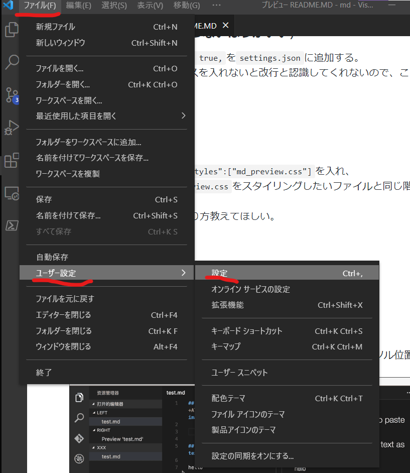
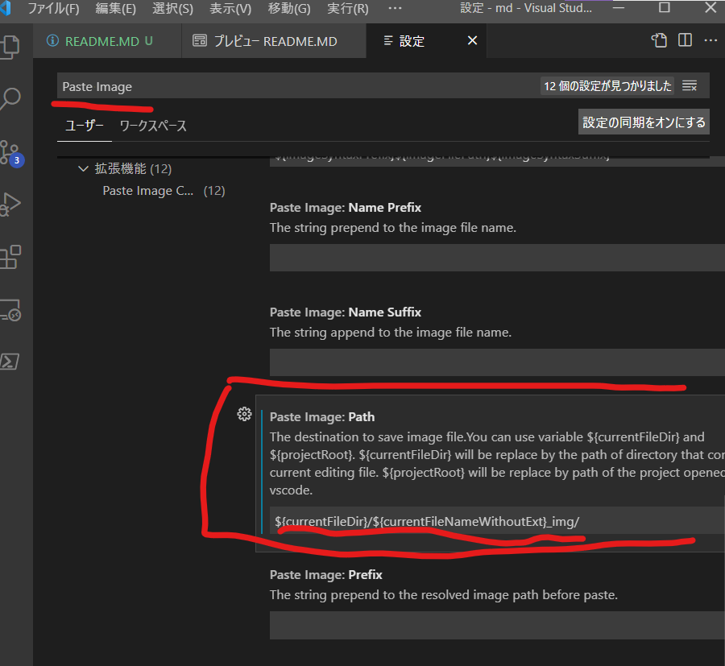

# vscodeでMarkdownを使うTips

作成日 2021年7月10日  
Copyright (c) 2021 Daichi Aoki  
Released under the [MIT license](https://github.com/blz-soft/md/blob/master/LICENSE)  


### プレビュー表示
`Ctl k → v`  
または、  
`Ctl + Shift + v`  

### 改行設定 (やっぱりやらないほうがいい)
`"markdown.preview.breaks": true,`を`settings.json`に追加する。     
[追記]Gitではダブルスペースを入れないと改行と認識してくれないので、この設定はしないほうがいい。
### スタイル変更
#### cssを使う場合
ユーザー設定に`"markdown.styles":["md_preview.css"]`を入れ、  
このフォルダにある`md_preview.css`をスタイリングしたいファイルと同じ階層に格納すれば利用できる。    
絶対パス設定ができず、やり方教えてほしい。  
#### 拡張機能を使う場合
[Markdown Preview Github Styling](https://marketplace.visualstudio.com/items?itemName=bierner.markdown-preview-github-styles)を追加する  
Github Markdown Previewというのもある

### 画像貼り付け
[Paste Image](https://marketplace.visualstudio.com/items?itemName=mushan.vscode-paste-image)を追加する  
画像をクリップボードに保持した状態で、`Ctrl Alt v`を押すとカーソル位置に画像が追加される。


#### 設定
設定画面を開き、


下の図のように設定を入力してください。

```
${currentFileDir}/${currentFileNameWithoutExt}_img/
```

### PDFファイルにエクスポート
[Markdown PDF](https://marketplace.visualstudio.com/items?itemName=yzane.markdown-pdf)を追加する。  
改行が反映されるようにするためには、`settings.json`に`"markdown-pdf.breaks": true,`を追記する。


## Markdown関係ない
### PDF表示
[vscode-pdf](https://marketplace.visualstudio.com/items?itemName=tomoki1207.pdf)
### CSV表示
[Rainbow CSV](https://marketplace.visualstudio.com/items?itemName=mechatroner.rainbow-csv)
### HTMl表示
[HTMLPreview](https://marketplace.visualstudio.com/items?itemName=tht13.html-preview-vscode)
### (){}色付け
[Bracket Pair Colorzier](https://marketplace.visualstudio.com/items?itemName=CoenraadS.bracket-pair-colorizer)  
  
### 全角色付け
[zenkaku](https://marketplace.visualstudio.com/items?itemName=mosapride.zenkaku)    
  
コマンドパレット`Ctrl Shift p`で以下のコマンド使い、機能をON,OFFする。  
有効にする
```
> Enable Zenkaku
```
無効にする
```
> Disable Zenkaku
```

## vscode関係ない
### gif作成
[ScreenToGif](https://github.com/NickeManarin/ScreenToGif)
手順書に動画やgifをつけれればきっとわかりやすいと思うので使っていきたい。


<script src="https://blz-soft.github.io/md_style/release/v1.2/md_style.js" ></script>